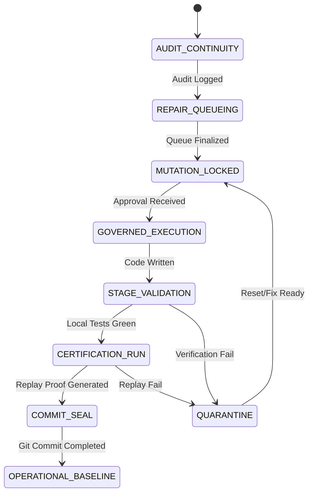

# Orchestration State Machine: P5

## Design Principles
- **Explicit State Persistence**: Every step must be explicitly mapped to a verifiable FS state.
- **Uni-directional Progression**: No rollbacks within a lock phase; failed phases enter `QUARANTINE`.
- **Human Gated Exits**: Critical transitions require explicit token activation.

## States

## Transition Rules

### 1. AUDIT_CONTINUITY → REPAIR_QUEUEING
- **Condition**: `forensics/continuity-audit.md` written and gap analysis completed.
- **Invariant**: Total count of uncommitted modified files locked.

### 2. REPAIR_QUEUEING → MUTATION_LOCKED
- **Condition**: `bounded-repair-queue.md` populated with high-priority fixes (starting with fixing the hallucinated repairs).
- **Requirement**: Prioritize "Completing what was claimed" before creating new functions.

### 3. MUTATION_LOCKED → GOVERNED_EXECUTION
- **Input**: USER `APPROVE_REPAIR_STAGE`.
- **Constraint**: Scope limited strictly to ONE node from the Bounded Repair Queue.

### 4. GOVERNED_EXECUTION → STAGE_VALIDATION
- **Condition**: Git DIFF created only for targeted files.
- **Assertion**: No side-effect mutations in unrelated components.

### 5. STAGE_VALIDATION → CERTIFICATION_RUN
- **Actions**: `npm run typecheck`, `flutter analyze`.
- **Condition**: 0 critical errors.

### 6. CERTIFICATION_RUN → COMMIT_SEAL
- **Actions**: Execute `infra/migration-replay/replay.sh`.
- **Artifact**: `replay-report.md` asserts SUCCESS.

### 7. COMMIT_SEAL → OPERATIONAL_BASELINE
- **Action**: `git add . && git commit -m "..."`.
- **Outcome**: Cognition enters STEADY_STATE.
