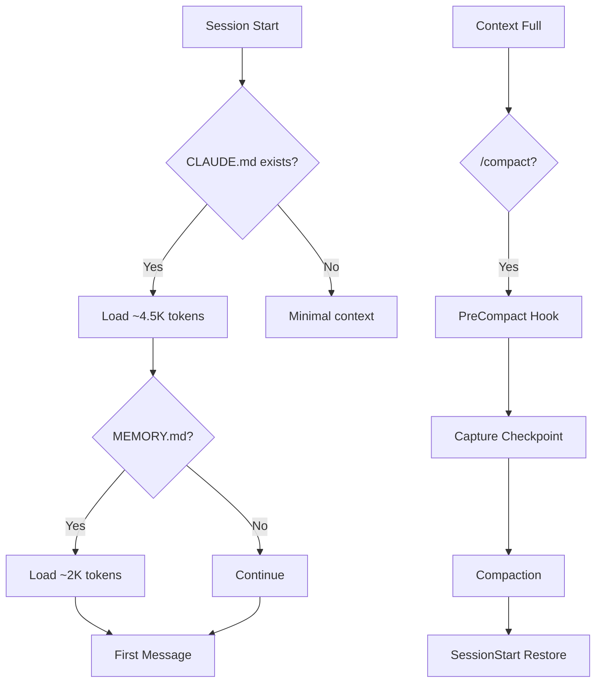
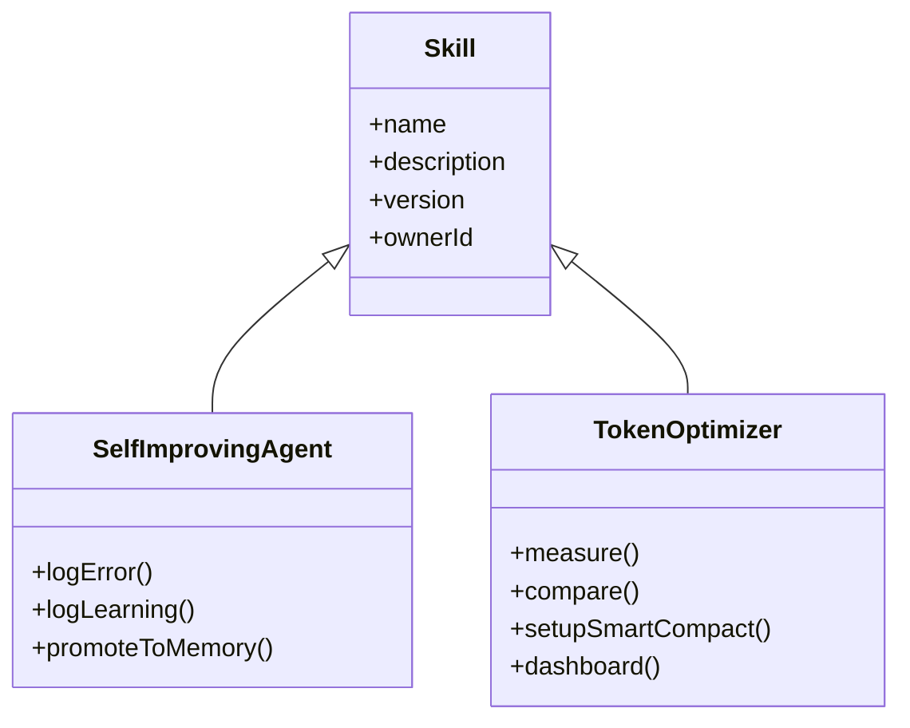
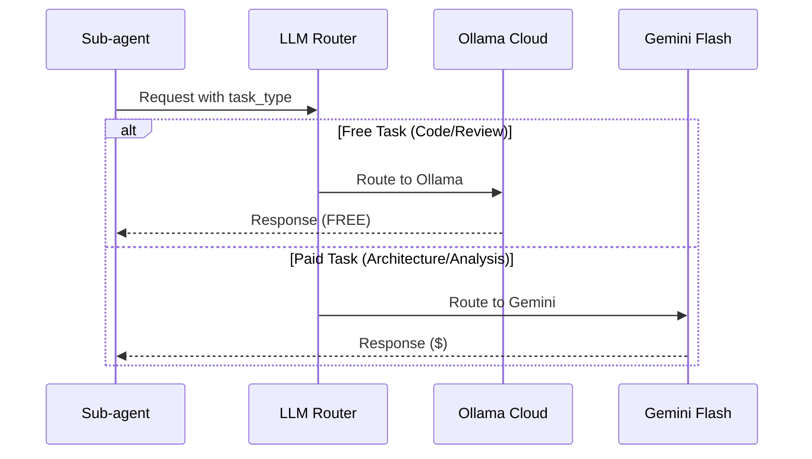
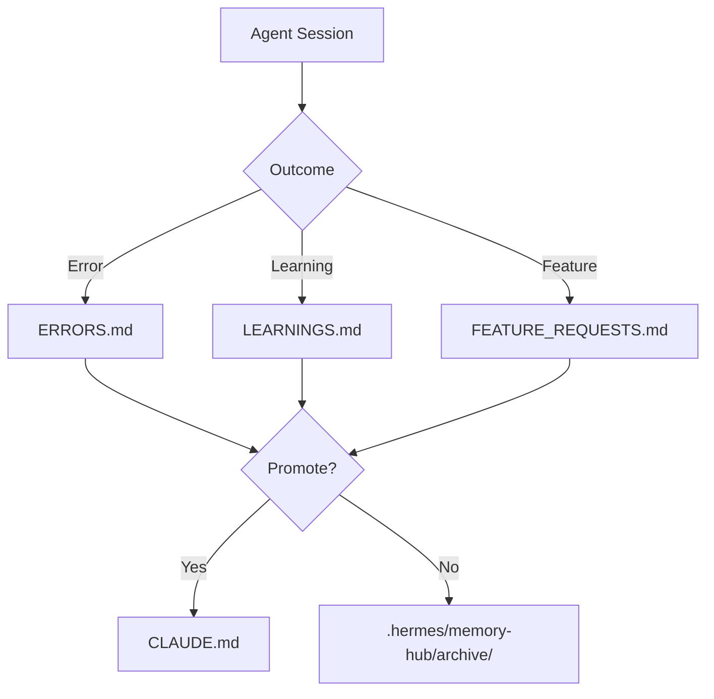

# AGENTS.md: LuckyStorePOS Agent Configuration

## Agent Configuration

| Platform | Config Location | Key Settings |
|----------|-----------------|--------------|
| **Antigravity IDE** | `.antigravity/config.json` | Model routing, inline commands |
| Ollama Cloud | `.ai/llm_config.json` | Free models: gemma3, qwen3-coder |
| Gemini | `.ai/llm_config.json` | Paid models: 2.5 Flash, 2.5 Pro |
| OpenClaw | `~/.openclaw/workspace/` | AGENTS.md, SOUL.md, TOOLS.md |

| Hook Type | Trigger | Handler | Purpose |
|-----------|---------|---------|---------|
| UserPromptSubmit | Every prompt | `activator.sh` | Learning reminder |
| PostToolUse | Bash commands | `error-detector.sh` | Error capture |
| PreCompact | Context full | `measure.py compact-capture` | Checkpoint |
| SessionEnd | Session close | `measure.py collect` | Usage stats |

## Context Management

| Layer | Tokens | Refresh Strategy |
|-------|--------|------------------|
| System | ~15,000 | Fixed per message |
| CLAUDE.md | ~2,000-5,000 | Manual update |
| MEMORY.md | ~1,500-3,000 | Auto-load project |
| Session Context | Variable | Compaction at 50-70% |



## Skill Registry

| Skill | Version | Trigger | Handler | Assets |
|-------|---------|---------|---------|--------|
| Self-Improving Agent | 3.0.21 | agent:bootstrap | hooks/openclaw/handler.ts | ERRORS.md, LEARNINGS.md, FEATURE_REQUESTS.md |
| Token Optimizer | 2.x | SessionEnd, PreCompact | scripts/measure.py | dashboard.html, checkpoints/ |
| Token Saver | 1.0 | Task start | .ai/skills/token-saver/ | ATOM enforcement, zero-cost routing |



| Registry File | Format | Update |
|---------------|--------|--------|
| `.skills_store_lock.json` | JSON | Auto on install |
| `_meta.json` | YAML frontmatter | Manual |

## Model Mapping

| Task | Provider | Model | Cost | Config Source |
|------|----------|-------|------|---------------|
| Quick chat | Ollama Cloud | gemma3:4b | **FREE** | `llm_config.json` |
| Code generation | Ollama Cloud | qwen3-coder:480b | **FREE** | `llm_config.json` |
| Code review | Ollama Cloud | kimi-k2.5 | **FREE** | `llm_config.json` |
| Deep thinking | Ollama Cloud | kimi-k2-thinking | **FREE** | `llm_config.json` |
| sequential_thought_generation | Gemini | 2.5 Flash | $0.075/1K | `llm_config.json` |
| research_query | Gemini | 2.5 Flash | $0.075/1K | `llm_config.json` |
| prd_generation | Gemini | 2.5 Flash | $0.075/1K | `llm_config.json` |
| task_decomposition | Gemini | 2.5 Flash | $0.075/1K | `llm_config.json` |
| agent_coordination | Gemini | 2.5 Flash | $0.075/1K | `llm_config.json` |
| synthesis | Gemini | 2.5 Pro | $0.15/1K | `llm_config.json` |
| verification | Gemini | 2.5 Flash | $0.075/1K | `llm_config.json` |



## Cost Control

| Strategy | Implementation | Impact |
|----------|----------------|--------|
| Model Tiers | Ollama Cloud (FREE) → Gemini Flash → Gemini Pro | Ollama free, Gemini paid |
| Batching | 1-500 vectors per request | API efficiency |
| Caching | Read-cache structural digests | Reduces re-reads |
| Compaction | Smart checkpoint restore | Context recovery |
| Prefer Free | Use Ollama for 90% of tasks | ~$0-10/month target |

| Metric | Target | Measurement |
|--------|--------|-------------|
| Context overhead | <20K tokens | `measure.py report` |
| Skill tokens | <100 each | Frontmatter only |
| MCP tools | <3K deferred | ToolSearch enabled |
| Savings | 5-25% | Before/after compare |

## ATOM (Active Token Optimization Mode)

Token Saver skill enforces zero-cost subscription routing with strict metered API blocking.

### Core Principles
- **$0/month metered API cost** — All operations route through subscription CLIs
- **Blocked endpoints**: api.anthropic.com, api.openai.com, generativelanguage.googleapis.com
- **Response format**: `[GOAL]` / `[CODE]` / `[RISK]`

### Active Subscriptions
| Service | CLI | Status |
|---------|-----|--------|
| Claude Code | `claude` | ACTIVE |
| Antigravity | `agy` | ACTIVE |
| Ollama Cloud | `ollama` | Available |

### Configuration
```bash
# Initialize token-saver state
bash .ai/skills/token-saver/references/runtime-detection.sh

# Check configuration
cat .agent-state/runtime.json
cat .agent-state/subscriptions.json
cat .agent-state/budget.json  # $0.00/month limit
```

### Blocked (Metered APIs)
- ANTHROPIC_API_KEY → Use `claude` CLI
- OPENAI_API_KEY → No zero-cost route (blocked)
- GEMINI_API_KEY → Use `agy` CLI (Antigravity)
- DEEPSEEK_API_KEY → No zero-cost route (blocked)

## Memory Hub

| Category | Location | Access Pattern |
|----------|----------|----------------|
| Forensics | `.hermes/memory-hub/forensics/` | Audit read |
| Governance | `.hermes/memory-hub/governance/` | Classification |
| Repairs | `.hermes/memory-hub/repairs/` | Execution log |
| Lineage | `.hermes/memory-hub/lineage/` | Mutation track |
| Replay | `.hermes/memory-hub/replay/` | Determinism |



---
*Agent Config Version: 2026.05.24*
