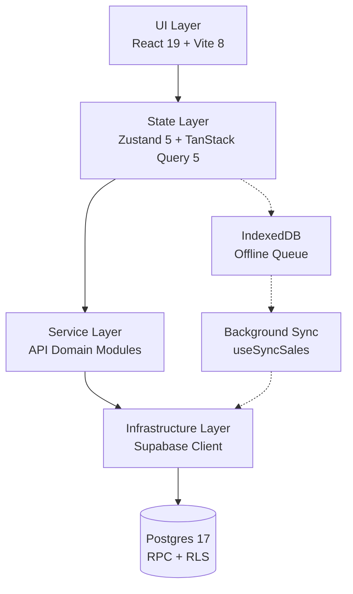
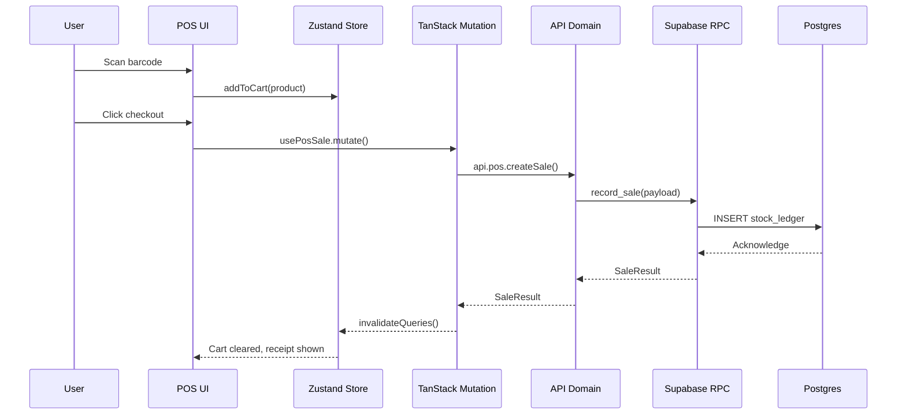
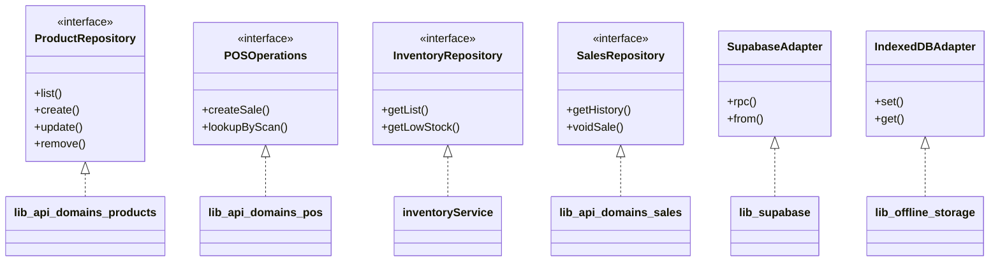
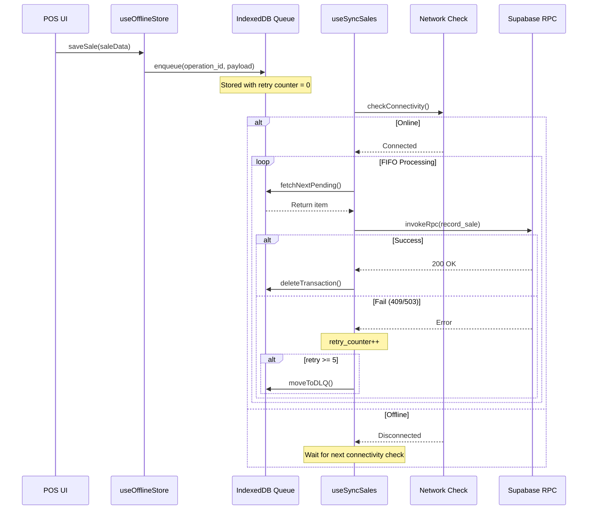
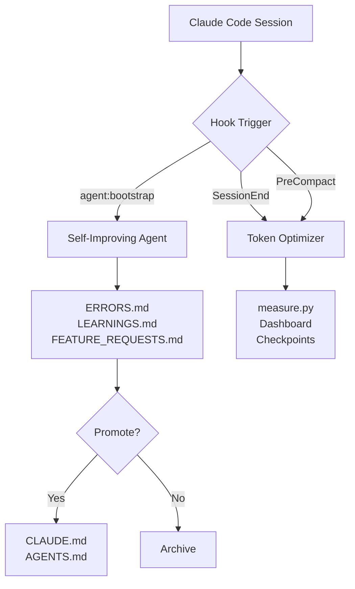
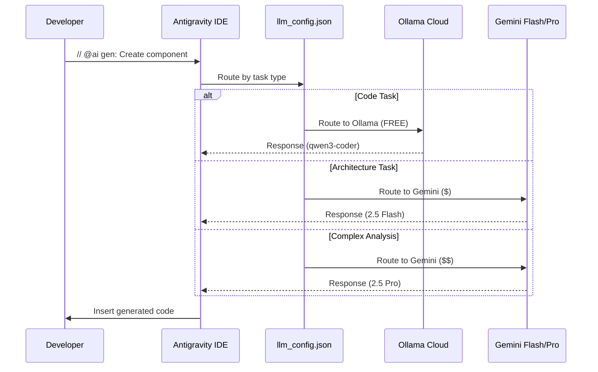
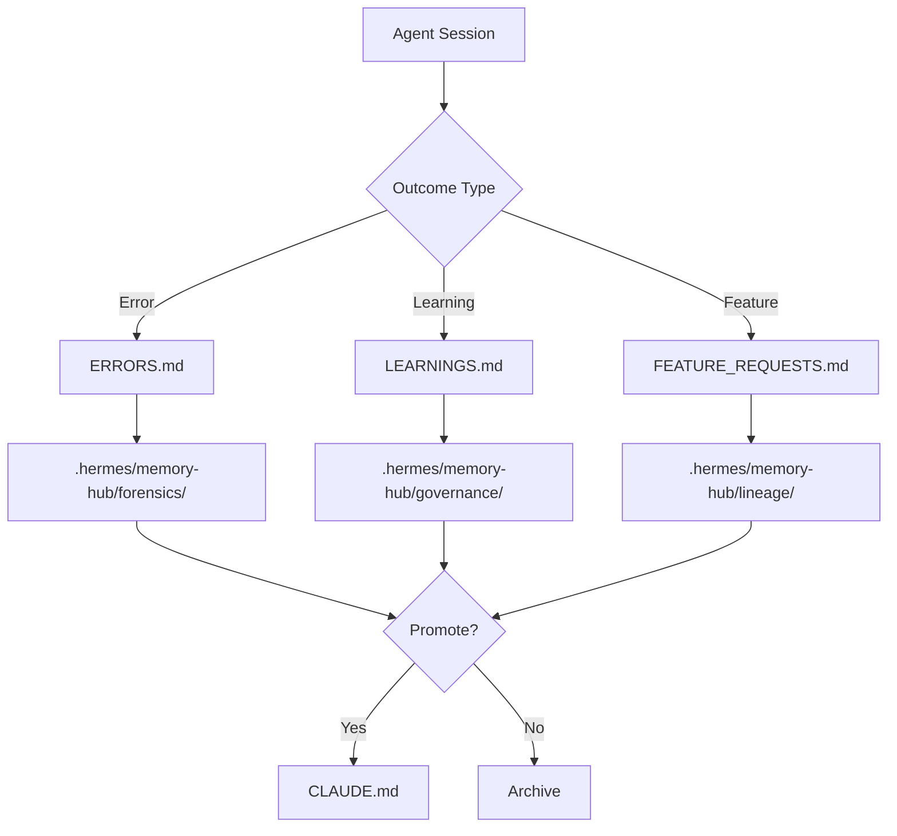
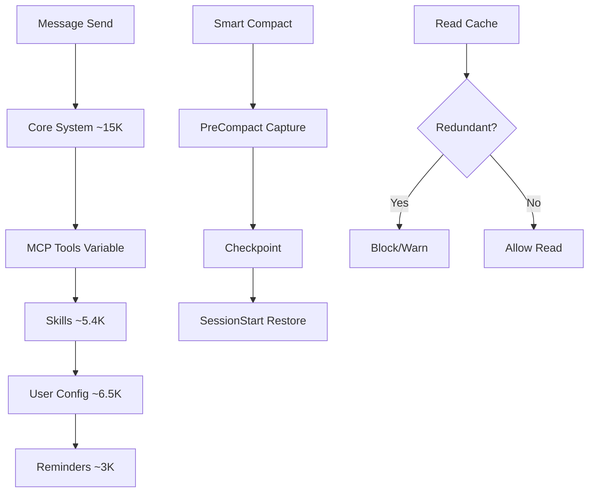
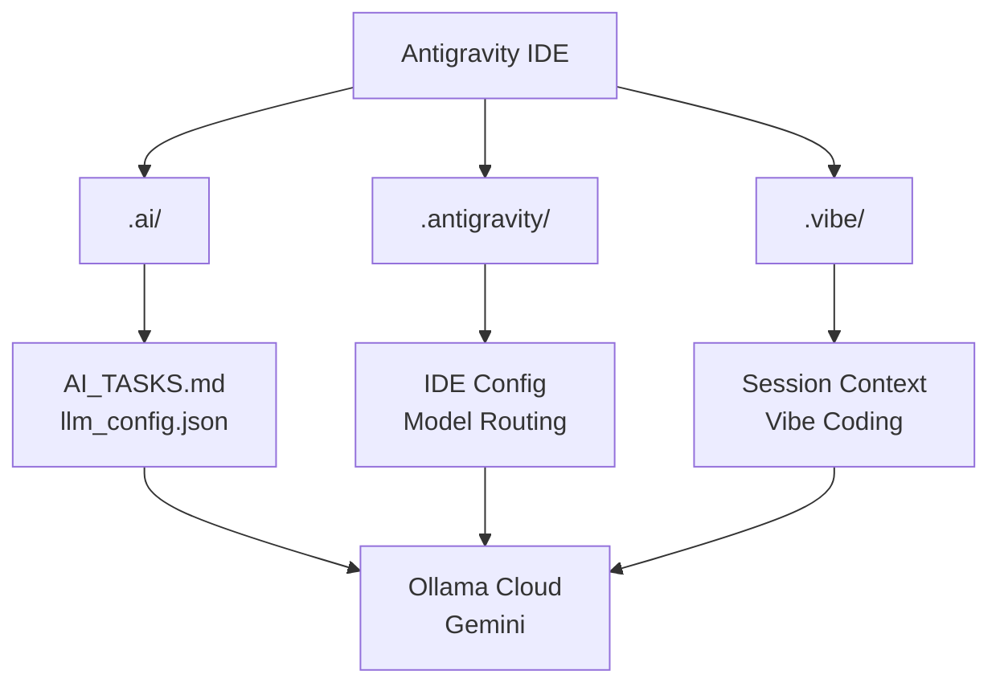

# ARCHITECTURE.md: LuckyStorePOS Enterprise Blueprint

## System Architecture

| Layer | Technology | Responsibility | Key Files |
|-------|-----------|----------------|-----------|
| UI | React 19, Vite 8 | Rendering, interaction | `apps/admin_web/src/` |
| State | Zustand 5, TanStack Query 5 | Optimistic updates, caching | `hooks/`, `stores/` |
| Service | TypeScript 6 | API abstraction, mappers | `lib/api/domains/` |
| Infrastructure | Supabase JS | Transport, auth, storage | `lib/supabase.ts` |
| Database | Postgres 17 | Persistence, constraints, RPC | `supabase/migrations/` |

## Data Flow

| Flow | Path | Latency Target |
|------|------|----------------|
| Online Sale | UI → Store → API → RPC → DB | <500ms |
| Offline Sale | UI → Store → IndexedDB | <50ms |
| Sync Drain | IndexedDB → API → RPC → DB | Batch 10/s |

## Ports & Adapters

| Port | Implementation | Location |
|------|---------------|----------|
| ProductRepository | products.list/create/update/remove | `lib/api/domains/products.ts` |
| POSOperations | pos.createSale/lookupByScan | `lib/api/domains/pos.ts` |
| InventoryRepository | inventoryService.getList/getLowStock | `services/inventory/inventoryService.ts` |
| SalesRepository | sales.getHistory/voidSale | `lib/api/domains/sales.ts` |
| DatabasePort | Supabase Client | `lib/supabase.ts` |
| StoragePort | IndexedDB | `lib/offline-storage.ts` |
| AuthPort | Supabase Auth | `lib/AuthProvider.tsx` |
| SyncPort | Background Sync | `hooks/useSyncSales.ts` |

## Offline Strategy

| Component | Technology | Purpose | File |
|-----------|-----------|---------|------|
| Offline Store | IndexedDB (idb-keyval) | Queue persistence | `lib/offline-storage.ts` |
| Sync Hook | TanStack Query + Network API | Background sync orchestration | `hooks/useSyncSales.ts` |
| Outbox | IndexedDB table | Transaction queue with metadata | `lib/offline-storage.ts` |
| DLQ | IndexedDB table | Dead letter for failed retries | `lib/offline-storage.ts` |

## MCP Skills Architecture

| Skill | Trigger | Handler | Output |
|-------|---------|---------|--------|
| Self-Improving Agent | agent:bootstrap | `hooks/openclaw/handler.ts` | Learning logs |
| Token Optimizer | SessionEnd, PreCompact | `scripts/measure.py` | Usage stats, checkpoints |

## LLM Routing

| Task Type | Provider | Model | Cost | Config Source |
|-----------|----------|-------|------|---------------|
| Quick questions | Ollama Cloud | gemma3:4b | **FREE** | `llm_config.json` |
| Code generation | Ollama Cloud | qwen3-coder:480b | **FREE** | `llm_config.json` |
| Code review | Ollama Cloud | kimi-k2.5 | **FREE** | `llm_config.json` |
| Deep thinking | Ollama Cloud | kimi-k2-thinking | **FREE** | `llm_config.json` |
| Architecture | Gemini | 2.5 Flash | Low ($0.075/1K) | `llm_config.json` |
| Research | Gemini | 2.5 Flash | Low ($0.075/1K) | `llm_config.json` |
| Complex analysis | Gemini | 2.5 Pro | Medium ($0.15/1K) | `llm_config.json` |
| Synthesis | Gemini | 2.5 Flash | Low ($0.075/1K) | `llm_config.json` |

## Vector Storage (Antigravity)

| Storage | Type | Status | Capacity |
|---------|------|--------|----------|
| File-based | Markdown + YAML frontmatter | Active | Unlimited |
| Supabase Vector | float32 arrays | Disabled | 10 buckets, 5 indexes |

## Token Lifecycle

| Phase | Tokens | Optimization |
|-------|--------|--------------|
| Fixed Floor | ~15,000 | Built-in tools |
| MCP (ToolSearch) | ~1,250-3,170 | Deferred loading |
| Skills | ~100 per skill | Frontmatter only |
| CLAUDE.md | ~2,000-5,000 | Target: ~4,500 |
| MEMORY.md | ~1,500-3,000 | 200-line cap |

## Business Domain
| Flow | Steps | Key Files |
|------|-------|-----------|
| POS Checkout | Scan → Cart → Payment → Receipt | `features/pos/`, `lib/api/domains/pos.ts` |
| Inventory Mgmt | Stock in → Adjust → Alert → Reconcile | `services/inventory/`, `hooks/useInventory` |
| Sales Reporting | Record → Aggregate → Void → Audit | `lib/api/domains/sales.ts` |

## Mobile Architecture
| Concern | Implementation | File |
|---------|---------------|------|
| State mgmt | Riverpod | `apps/mobile_app/lib/` |
| Offline storage | SQLite + Supabase local | `apps/mobile_app/lib/offline/` |
| Hardware | Barcode scanner, receipt printer | `apps/mobile_app/lib/hardware/` |
| Sync | Outbox pattern, background sync | `hooks/useSyncSales.ts` |

## Database Layer
| Component | Purpose | File |
|-----------|---------|------|
| Core tables | products, sales, inventory, stores | `supabase/migrations/` |
| RPCs | record_sale, complete_sale_v2, get_inventory_list | `supabase/migrations/` |
| RLS | Row-level security per store | `supabase/migrations/` |
| Triggers | inventory auto-update on sale | `supabase/migrations/` |

## Edge Functions
| Function | Trigger | Purpose | File |
|----------|---------|---------|------|
| whatsapp-order-notify | HTTP | Order notifications | `supabase/functions/whatsapp-order-notify/` |
| create-bkash-checkout | HTTP | Payment processing | `supabase/functions/create-bkash-checkout/` |

## Scraper Subsystem
| Component | Role | File |
|-----------|------|------|
| AI Mapper | Gemini product categorization | `apps/scraper/ai-mapper.js` |
| Scheduler | Daily runs | `.github/workflows/scraper-daily.yml` |
| Output | Product data ingestion | `apps/scraper/` |

## Storefront
| Concern | Implementation | File |
|---------|---------------|------|
| Framework | Next.js 16 | `apps/customer_storefront/` |
| Styling | Tailwind v4 | `apps/customer_storefront/postcss.config.mjs` |
| Shared code | Feature slices | `apps/customer_storefront/src/app/` |
| Deploy | Vercel | `vercel.json` |

---
*Architecture Version: 2026.05.22*

## AI Infrastructure Architecture

| Component | Location | Purpose | Status |
|-----------|----------|---------|--------|
| AI Config | `.ai/` | Task queue, routing, prompts | ✅ Active |
| IDE Integration | `.antigravity/` | IDE settings, commands | ✅ Active |
| Vibe Coding | `.vibe/` | Session context, workflow | ✅ Active |
| Patterns | `docs/vibe-guides/` | React/Flutter/Supabase patterns | ✅ Active |
| Skills | `.agents/skills/`, `.gemini/skills/` | Token optimization | ✅ Active |
| Memory | `.hermes/memory-hub/` | Forensics, governance | ✅ Active |
| Scripts | `scripts/dev/` | AI helper, sync, checkpoint | ✅ Active |

### Model Providers

| Provider | Endpoint | Models | Cost |
|----------|----------|--------|------|
| **Ollama Cloud** | `ollama.com/api` | gemma3, qwen3-coder, kimi-k2 | **FREE** |
| **Gemini** | `generativelanguage.googleapis.com` | 2.5 Flash, 2.5 Pro | Pay-as-you-go |

### Daily Workflow

1. **Start session**: `./scripts/dev/vibe-start.sh task-name`
2. **Load context**: Antigravity auto-loads `.ai/AI_TASKS.md`, `.vibe/current/context.md`
3. **Code with AI**: Use `// @ai gen: ...` inline commands
4. **Checkpoint**: `./scripts/dev/ai-checkpoint.sh`

## Governance & Safety

| Component | Location | Purpose |
|-----------|----------|---------|
| Replay Certification | `scripts/replay-certification/` | Migration determinism |
| Safety Scripts | `scripts/safety/` | Runtime guardrails |
| Governance | `scripts/governance/` | Policy enforcement |
| Artifacts | `artifacts/` | Build certification, quarantine |
| Infra Replay | `infra/migration-replay/` | Isolated testing |

## Testing Matrix

| Type | Location | Framework | Coverage |
|------|----------|-----------|----------|
| Integration | `test/integration/` | Vitest | 0% |
| Load | `test/load/` | Custom | 0% |
| Unit | `test/unit/` | Vitest | 0.5% |
| Offline | `apps/mobile_app/test/offline/` | flutter_test | Partial |
| Performance | `apps/mobile_app/test/performance/` | flutter_test | Partial |
