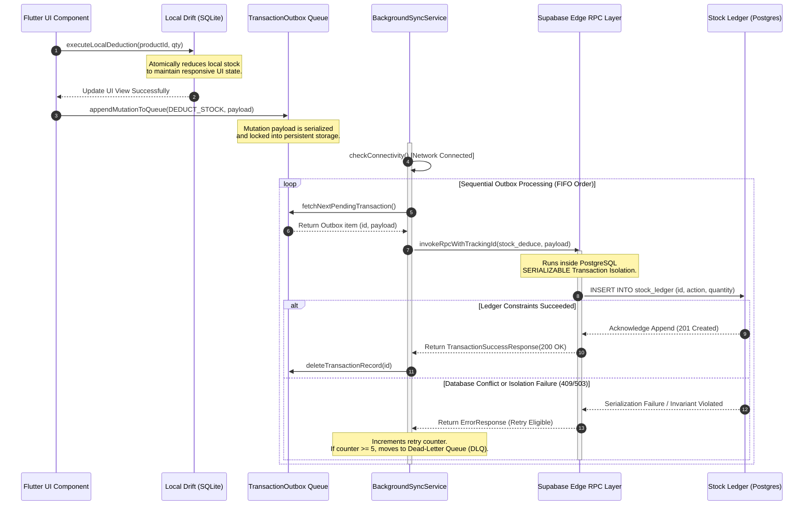

# ARCHITECTURE.md: luckystorePOS Comprehensive Enterprise Blueprint

## 1. 🏗️ Architectural Overview & Design Philosophy
luckystorePOS is a high-availability, multi-tenant distributed retail operating network engineered specifically for the extreme infrastructure constraints of Bangladeshi corner-store retail spaces. The system guarantees absolute transactional integrity, real-time edge processing, and multi-tenant ledger isolation across intermittently connected environments.

       +─────────────────────────────────────────────────────────+
       |                  CLOUD STATE LAYER                      |
       |                   Supabase (Postgres)                   |
       |    [RPC Mutations] [Stock Ledger] [RLS Enforcement]     |
       +───────────────────────────┬─────────────────────────────+
                                   │
                    ▲              │ Asynchronous FIFO Sync
      Edge Pull /   │              │ (BackgroundSyncService)
   Stitch Trigger   │              ▼
                                   │
        +─────────────────────────────────────────────────────────+
        |                   LOCAL STATE LAYER                     |
        |        Web (Zustand + React Query + IndexedDB)          |
        |        Mobile (Riverpod + Hive + BLE Printer)           |
        +─────────────────────────────────────────────────────────+

### Core Architecture Pillars
*   **Offline-First Sync Engine:** The system uses IndexedDB (Web) and Hive (Mobile) as primary storage. All mutations are queued in a persistent Outbox and synced via React Query (Web) or Riverpod-driven sync services (Mobile) when connectivity is restored.
*   **Immutable Double-Entry Ledger System:** State is never modified or overwritten using typical CRUD operations. Every change in physical item volumes triggers a physical database append operation.
 Current real-time stock levels are structurally derived on-demand or compiled down to deterministic materialized views. This design ensures that every transactional modification can be audited reliably.
*   **Distributed Replay Determinism & Verification:** To guarantee state convergence across disconnected client runtimes, the backend employs a strict schema validation policy and an offline-to-online script execution matrix. Every migration must execute through a containerized Postgres runner to verify that real-world operations can be safely replayed.
*   **Stitch-Orchestrated Core Operations:** Non-critical path services (such as competitor price updates, data scraping transformations, or secondary analytics pipelines) are entirely decoupled from core transactional loops via asynchronous triggers. This pattern limits blockages inside critical POS customer checkouts.

---

## 2. 📁 Exhaustive Repository Directory Tree
```text
.
├── .agents/                                 # Agent-specific orchestration blueprints and context definitions
├── .gemini/                                 # Dedicated AI memory vectors, automation profiles, and skill manifests
├── .github/                                 # CI/CD pipeline infrastructure blueprints
│   └── workflows/
│       └── migration-replay.yml            # CI runner validating schema execution and rollback parity
├── _plans/                                  # Multi-stage strategic engineering execution blueprints
│   ├── claudeplan                           # Milestone tracing documents for asynchronous architecture
│   └── kimik2plan                           # Active tracking protocols for system-wide performance targets
├── apps/                                    # Top-level standalone application deployment targets
│   ├── admin_web/                           # Enterprise Dashboard web application
│   │   ├── src/
│   │   │   ├── components/                 # Atomic UI building blocks
│   │   │   ├── features/                   # Domain-focused feature slices (Sellers, Inventory, Metrics)
│   │   │   └── lib/                         # Local core wrappers around external SDKs
│   │   ├── package.json
│   │   └── vercel.json                     # Standalone monorepo reverse-proxy and rewrite router rules
│   ├── mobile_app/                          # High-performance distributed Flutter POS application
│   │   ├── lib/
│   │   │   ├── config/                     # Environment schemas and static feature configurations
│   │   │   ├── features/
│   │   │   │   └── inventory/               # On-device barcode mechanics and scanner logic
│   │   │   ├── offline/                    # On-device replication engines
│   │   │   │   ├── background_sync_service.dart  # Online outbox draining orchestration engine
│   │   │   │   └── db.dart                  # Drift-backed SQLite local relational data mapping
│   │   │   └── shared/
│   │   │       └── services/
│   │   │           └── startup_guard_service.dart # Hard block bootstrap engine validating local environments
│   │   ├── test/
│   │   │   ├── offline/
│   │   │   │   ├── empirical_replay_test.dart    # Evaluates state resilience across connection failures
│   │   │   │   └── outbox_test.dart         # Validates FIFO queuing and DLQ fallback logic
│   │   │   └── widget_test.dart
│   │   └── pubspec.yaml                     # Dependencies mapping background tasks and local database mechanics
│   └── scraper/                             # Node.js competitor data harvesting and ingestion utility
│       ├── src/
│       │   ├── index.ts                     # Pipeline Entry point
│       │   └── procurement.ts               # Core parsing mechanics mapping merchant catalog trees
│       └── package.json
├── artifacts/                               # Hard tracking historical state artifacts
│   ├── baseline.json                        # Frozen cryptographically secure schema signature blueprint
│   └── snapshots/                           # DB definitions mapped to verify migration immutability
├── data/                                    # Ingested offline static databases and structural raw profiles
├── docker/                                  # Isolated runtime engine containers
├── docs/                                    # Authoritative product specifications and compliance protocols
│   └── architecture/                        # Deep-dive sub-module design requirements
│       ├── api-conventions.md               # RPC signaling definitions and HTTP header guidelines
│       ├── auth.md                          # Multi-tenant context and cryptographic state tracking
│       ├── database.md                      # Core physical tables layout policy
│       ├── domain-events.md                 # System-wide event signaling contract documentation
│       ├── inventory-ledger.md              # Explicit balance validation constraints
│       ├── migration-policy.md              # Guidelines for zero-downtime structural database refactoring
│       ├── offline-sync.md                  # Protocol specifications for local outbox state changes
│       ├── rpc-contracts.md                 # Remote procedure call parameters and execution models
│       └── ui-system.md                     # Constraints regarding client interface patterns
├── evals/                                   # High-concurrency simulation suites testing data correctness
├── infra/                                   # Hard containerized testing setups for continuous integration pipelines
├── lib/                                     # Shared multi-platform architectural features
├── scripts/                                 # Engineering governance maintenance script systems
│   ├── governance/                          # Verifies structural drift across environments
│   ├── ops/                                 # Remote backup tools and emergency cluster maintenance keys
│   └── replay-certification/                # Replays live database transactions to certify accuracy
└── supabase/                                # Relational master cloud layer configuration
    ├── functions/                           # Edge Computing Deno 2 Serverless runtime units
    ├── migrations/                          # Imputable relational database evolution lineage (97+ sequential files)
    │   ├── 20260519160000_stitch_orchestration.sql
    │   └── 20260519215146_quarterly_ledger_partition.sql
    ├── rpc/                                 # Thread-safe database stored procedures
    ├── views/                               # Aggregation projections representing point-in-time states
    ├── config.toml                          # Central orchestration configuration profile
    └── seed.sql                             # Deterministic local simulation mock data setup
```

---

## 3. 🔍 Deep-Dive Component Breakdown

| Component/Directory | Technical Responsibility & Boundaries | Upstream/Downstream Dependencies |
| :--- | :--- | :--- |
| `apps/mobile_app` | Captures offline transactions; manages persistent Drift queue; handles state updates independent of cloud connectivity. | Upstream: `lib/features` (Shared Models) / Downstream: `supabase/rpc` (Cloud Sync) |
| `apps/admin_web` | Aggregates and renders analytical dashboards; enforces store policy configs; manages supply-chain reporting. | Upstream: `supabase/` (Views & Analytical Queries) |
| `supabase/` | Standardizes cloud state storage; enforces multi-tenant RLS policies; updates core append-only ledger tables. | Upstream: `apps/mobile_app` (Sync Streams) / Downstream: `apps/admin_web` (Subscriptions) |
| `docs/architecture` | Specifies operational requirements; outlines structural limits; defines interface contracts. | Upstream: None (Single Source of Truth) / Downstream: All feature branches |
| `scripts/replay-certification` | Runs automated simulations in isolated environments to confirm migration validity. | Upstream: `supabase/migrations` / Downstream: `infra/` (Testing Runtimes) |
| `apps/scraper` | Collects competitor catalogs/prices; formats structural lists for backend ingestion. | Downstream: `supabase/functions` (Data Hydration) |

---

## 4. 🔄 Core Data & State Synchronization Flow
**Atomic Stock Deduction (`stock_deduce`) Lifecycle**



---

## 5. 🛠️ Strict Monorepo Governance & Scaling Rules

1.  **Ledger Immutability (Non-Negotiable)**: You are forbidden from performing `UPDATE` or `DELETE` on any ledger-linked table (e.g., `stock_ledger`, `inventory_movements`, `ledger_audit_logs`). If an error is introduced during operational entries, it must be corrected by creating a matching, offset entry that maintains the ledger balance trail.
2.  **Non-Deterministic Pre-Commit Check**: No schema modification (supabase/migrations/*.sql) can be merged into the production branch without first passing the `scripts/replay-certification/` execution pipeline. Migrations that rely on dynamic server variables, local timestamps, or non-deterministic GUID values will fail verification checks.
3.  **Isolation of Client UI States**: Application interface configurations inside `apps/mobile_app` and `apps/admin_web` must remain separated from the underlying state engine. Interfacing layers are required to communicate via independent service boundaries (e.g., `InventoryService`). They must not make direct relational calls to the local system database tables.
4.  **Mandatory Idempotency Tokens**: Every mutation entry recorded by the local engine into `TransactionOutbox` must contain a unique tracking ID (`operation_id`). The receiving remote database layer validates this ID to prevent processing duplicated transactions in the event of unexpected network drops during the sync loop.
5.  **Documentation Contract**: Before submitting any pull request that updates database schemas or communication structures, developers must ensure the changes mirror the specifications outlined in the `docs/architecture/` directory. If a change breaks an interface pattern defined in `rpc-contracts.md` or `offline-sync.md`, the documentation must be updated in the same PR.
