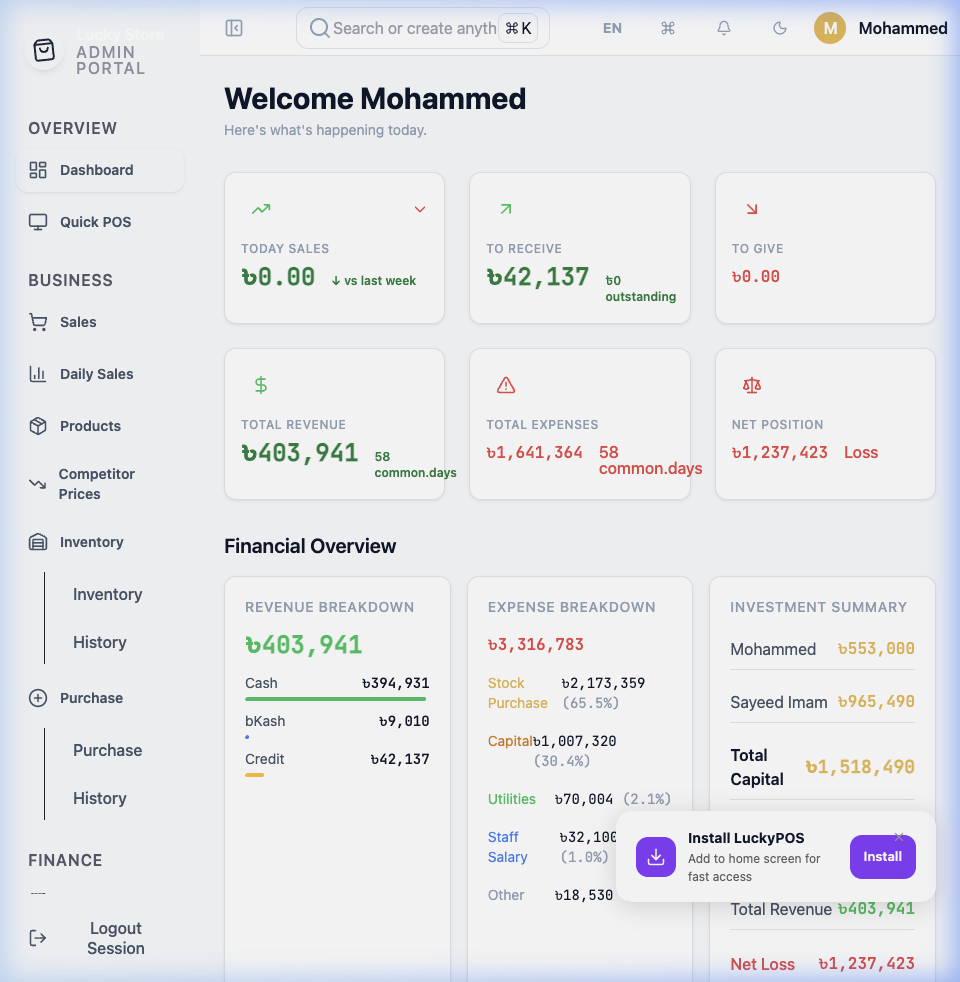

<div align="center">



</div>

<p align="center">
  
  &nbsp;
  
  &nbsp;
  
</p>

<p align="center">
  
  &nbsp;
  
  &nbsp;
  
  &nbsp;
  
  &nbsp;
  
</p>

---

<p align="center">
  <strong>A free, open-source Point of Sale system built for retail shops in Bangladesh</strong><br>
  <em>bKash Payments | Offline-First | Bangla Interface | Bluetooth Label Printing | Real-Time Inventory | AI Price Monitoring</em>
</p>

<p align="center">
  <a href="https://adminweb-blond.vercel.app/">
    
  </a>
  &nbsp;
  <a href="https://github.com/saaedimam/luckystorePOS/releases">
    
  </a>
</p>

---

## 📋 Quick Navigation

<p align="center">

[Why Lucky Store?](#-why-lucky-store-pos) ·
[Screenshots](#-screenshots) ·
[Features](#-features) ·
[Tech Stack](#-tech-stack) ·
[Quick Start](#-quick-start) ·
[Deployment](#-deployment) ·
[Contributing](#-contributing)

</p>

---

## 🤔 Why Lucky Store POS?

**Lucky Store POS is purpose-built for the reality of Bangladeshi retail:** intermittent internet, bKash dominance, thermal label culture, and the need for both Bangla and English at the counter.

| Feature | **Lucky Store POS** | Traditional POS | Cloud-Only POS |
|:--------|:-------------------|:----------------|:---------------|
| **Offline Mode** | Full offline with Drift SQLite; auto-syncs when back online | Paper-based fallback only | Stops working completely |
| **bKash Payments** | Native bKash checkout built into the POS flow | Manual reconciliation | Not available |
| **SSLCommerz Cards** | Integrated card + mobile banking gateway | Separate terminal required | May support, generic |
| **Bluetooth Label Printing** | MHT-P29L TSPL, Code128 barcodes, 40x30mm labels | Manual price tagging | Not supported |
| **Bangla Interface** | English + Bangla with HindSiliguri font throughout | English-only | English-only |
| **Competitor Price Monitoring** | AI-powered scraping of Shwapno, Chaldal, AamaderBazar | Not available | Not available |
| **Multi-Tenant Security** | Supabase RLS with tenant isolation per store | Basic auth only | Basic auth only |
| **Deployment** | Docker one-command, Vercel free tier, APK sideload | Complex server setup | Vendor lock-in |
| **Cost** | Free & Open Source (Apache 2.0) | License fees + hardware | Monthly SaaS fees |
| **Realtime Inventory** | Supabase realtime subscriptions; low-stock alerts | End-of-day manual counts | Polling-based only |

---

## 📸 Screenshots

### 💻 Admin Dashboard (React + Vite)

<div align="center">


*Live sales analytics, revenue trends & key business metrics — verified against production Supabase staging database*

</div>

### 📱 Mobile App (Flutter) — Coming Soon

> Mobile screenshots are being captured. Download the [APK from GitHub Releases](https://github.com/saaedimam/luckystorePOS/releases) to see the Flutter POS app in action.

---

## ✨ Features

### 📱 Mobile POS (Flutter)

| Sales Management | Barcode Scanning | Offline Mode |
|:----------------:|:---------------:|:------------:|
| Cash, bKash, Card & Credit payments | Camera-based (Code128, EAN-13, QR) | Drift SQLite with background sync |

| Inventory Tracking | Label Printing | Localization |
|:------------------:|:-------------:|:------------:|
| Real-time stock + low-stock alerts | MHT-P29L Bluetooth, TSPL, 40×30mm labels | English + Bangla (HindSiliguri font) |

| PIN-Based Auth | Manager Dashboard | Store Operations |
|:-------------:|:-----------------:|:----------------:|
| Staff PIN via Supabase RPC | Close review, risk analytics, session summaries | Open/close shifts, cash reconciliation |

<details>
<summary><strong>🔍 Offline-First Architecture</strong></summary>

<br>

- **Drift (SQLite ORM)** for full local product catalog, cart, and sale recording
- **Background sync** via WorkManager + flutter_background_service
- **Conflict resolution** with idempotency keys and server-authoritative override
- **Feature toggle:** `ENABLE_OFFLINE_MODE=true`
- See: [Conflict Resolution Policy](docs/conflict_resolution_policy.md)

</details>

<details>
<summary><strong>🔍 Payment Methods</strong></summary>

<br>

- **Cash** — default tender with change calculation
- **bKash** — native mobile banking checkout flow
- **SSLCommerz** — card payments (Visa, Mastercard) + mobile banking gateways
- **Credit** — customer ledger posting for deferred payment
- **Split payments** — multiple tenders per sale

</details>

<details>
<summary><strong>🔍 Bluetooth Label Printing (MHT-P29L)</strong></summary>

<br>

- Bluetooth connection via `flutter_blue_plus`
- TSPL command format for MHT-P29L thermal printers
- Code128 barcode generation via `barcode_widget`
- 40×30mm labels with MRP strikethrough pricing
- Bulk printing from CSV files
- Print retry queue for reliability

</details>

<details>
<summary><strong>🔍 Barcode Scanning</strong></summary>

<br>

- Camera-based scanning via `mobile_scanner` package
- Supports Code128, EAN-13, and QR code formats
- Instant product lookup in POS flow
- Auto-barcode generation (EAN-13) on product import

</details>

---

### 💻 Admin Web (React + Vite + TypeScript)

| Analytics Dashboard | POS Checkout | Product Management |
|:------------------:|:-----------:|:-----------------:|
| Sales trends, Recharts charts, low-stock alerts | Cart checkout, barcode lookup, receipt preview | Category thumbnails, grid/list toggle, image upload |

| Inventory Control | Finance Ledgers | Collections |
|:-----------------:|:--------------:|:-----------:|
| Real-time stock, adjust/history, status badges | Supplier payables + Customer receivables with aging | Overdue follow-ups, payment tracking |

| Purchase Management | Expense Tracking | PWA Support |
|:------------------:|:--------------:|:-----------:|
| Purchase entry, receiving, history | Pie/bar charts, 6 categories, 4 payment types | Installable on any device, offline caching |

<details>
<summary><strong>🔍 Dashboard & Analytics</strong></summary>

<br>

- **5 MetricCards:** To Receive, To Give, Today Sales, Stock Purchases, Expense
- **Custom bar chart:** Sales vs Expenses vs Stock Purchases (14-day view)
- **Payment breakdown:** Cash/bKash/Credit with percentage progress bars
- **Low-stock alerts** and **upcoming reminders** widgets
- **Realtime toast notifications** on new sales via Supabase Realtime

</details>

<details>
<summary><strong>🔍 Finance, Ledgers & Collections</strong></summary>

<br>

- **Supplier Ledger** — payables, aging summary, transaction history
- **Customer Ledger** — receivables, credit history, balance tracking
- **Collections Workspace** — overdue customer list with days-overdue, promise-to-pay dates, quick actions (call/SMS/note/payment)
- **Expense Tracking** — pie + bar charts (Recharts), 6 categories (Stock Purchase, Capital Expenditure, Utility, Transport, Salary, Partners Take, Other), 4 payment types
- **Daily Sales** — end-of-day manual entry with line+bar charts, period comparisons

</details>

<details>
<summary><strong>🔍 PWA (Progressive Web App)</strong></summary>

<br>

- Installable on desktop, tablet, and mobile — no app store needed
- Service worker with offline caching (custom Vite build via `build-sw.mjs`)
- Install prompt banner and offline indicator
- Works on any modern browser

</details>

---

### 🔐 Backend & Security (Supabase)

| Dimension | Count |
|:----------|:-----|
| Database tables | 50+ |
| SQL migrations | 80+ |
| Stored procedures (RPCs) | 80+ |
| Edge functions (Deno) | 8 |
| RLS policies | Tenant-isolated on every table |

<details>
<summary><strong>🔍 Edge Functions</strong></summary>

<br>

| Function | Purpose |
|:---------|:--------|
| `create-sale` | Rate-limited sale creation with input validation, auth verification, and `complete_sale` RPC |
| `adjust-stock` | Stock adjustment with configurable CORS |
| `import-inventory` | CSV/XLSX import with auto-barcode (EAN-13), image upload, batch/expiry tracking, audit trail |
| `create-card-checkout` | SSLCommerz card checkout session initiation |
| `payment-ipn` | SSLCommerz Instant Payment Notification validator |
| `payment-return-success` | SSLCommerz success callback handler |
| `payment-return-fail` | SSLCommerz failure callback handler |
| `payment-return-cancel` | SSLCommerz cancellation callback handler |

</details>

<details>
<summary><strong>🔍 Security Architecture</strong></summary>

<br>

- **Tenant-Isolated Row-Level Security** — every table has RLS policies isolating data per store
- **Multi-tenant** — single Supabase project serves unlimited stores
- **PIN-based staff auth** via `authenticate_staff_pin` RPC (separate from admin email/password)
- **Service role key** used only in edge functions; anon key for client operations
- **Rate limiting** via database-backed `rate_limits` table + `check_rate_limit` RPC
- **Input validation** on all edge functions (UUID format, positive numbers, max amounts)
- See: [RLS Security Model](docs/RLS_SECURITY_MODEL.md)

</details>

<details>
<summary><strong>🔍 SSLCommerz Payment Flow</strong></summary>

<br>

1. **Edge function** creates checkout session with sale details
2. **Redirect** to SSLCommerz hosted payment page
3. **IPN edge function** processes SSLCommerz callback (validates, records payment)
4. **Success/fail/cancel** return handlers update sale status
5. Supports **Visa, Mastercard, bKash, Nagad, Rocket** through a single gateway

</details>

---

### 🕵️ Competitor Price Monitoring

<details>
<summary><strong>🔍 AI-Powered Scraping of Bangladeshi Retailers</strong></summary>

<br>

- **Puppeteer-based scraping** of major Bangladeshi retailers:
  - **Shwapno** — Bangladesh's largest retail chain
  - **Chaldal** — leading online grocery (per-category: biscuits, chocolates, beverages, noodles, etc.)
  - **AamaderBazar** — competitive pricing data
  - **Unilever Bangladesh** — brand-level pricing
- **AI product mapping** via string-similarity algorithms
- **Price comparison generation** for reporting and competitive analysis
- Data stored in Supabase for reporting and competitive analysis
- Run: `cd apps/scraper && npm run update-prices`

</details>

---

## 🛠 Tech Stack

### Mobile App
**Flutter 3.29.3** · Dart ≥3.7.2 · Provider · Drift (SQLite) · supabase_flutter · flutter_blue_plus · mobile_scanner · fl_chart · workmanager · flutter_background_service · flutter_dotenv · google_fonts · intl · barcode_widget · esc_pos_utils_plus · pdf · printing · csv · excel · webview_flutter

### Admin Web
**React 19** · Vite 8 · TypeScript 6.0 (strict) · Tailwind CSS 3.4 · React Router 7 · TanStack Query 5 · TanStack Virtual 3 · Recharts 3 · React Hook Form 7 · Zod 4 · Lucide React · date-fns · clsx

### Backend
**Supabase** · PostgreSQL 17 · Deno Edge Functions · Row-Level Security · Realtime Subscriptions · Storage

### DevOps
**Docker** (multi-stage Node 22 + Nginx 1.27 Alpine) · GitHub Actions (Flutter analyze/test/build + admin TS check/build) · Vercel (landing page + admin hosting)

### Scraper
**Node.js** · Puppeteer · string-similarity · xlsx

---

## 🚀 Quick Start

### Prerequisites

| Tool | Minimum Version | Check |
|:-----|:---------------|:------|
| Flutter SDK | ≥ 3.29.3 | `flutter --version` |
| Node.js | ≥ 20.0.0 | `node --version` |
| npm | ≥ 10.0.0 | `npm --version` |
| Supabase CLI | ≥ 1.0.0 | `supabase --version` |
| Docker | ≥ 24.0.0 | `docker --version` *(optional)* |

### Setup

```bash
# 1. Clone and configure
git clone https://github.com/saaedimam/luckystorePOS.git
cd luckystorePOS
cp .env.example .env
# Edit .env with your Supabase URL and anon key

# 2. Start Supabase locally (optional — skip to use remote staging)
supabase start
supabase db reset

# 3. Run the Flutter mobile app
cd apps/mobile_app
flutter pub get
flutter run

# 4. Run the admin web dashboard
cd apps/admin_web
npm install
npm run dev                  # Opens at http://localhost:5173/admin/

# 5. Docker (optional — production-like)
docker compose up -d         # Admin web at http://localhost:8080
```

> **Tip:** For a full local developer setup guide including Docker configuration, seed credentials, and local vs. remote Supabase mode, see the **[Developer Runbook](docs/DEVELOPER.md)**.

---

## 📁 Project Structure

```
luckystorePOS/
├── apps/
│   ├── mobile_app/          # Flutter POS app
│   ├── admin_web/           # React + Vite admin dashboard
│   └── scraper/             # Puppeteer competitor price scraper
├── supabase/
│   ├── migrations/          # 80+ SQL migration files
│   ├── functions/           # 8 Deno edge functions
│   └── config.toml          # Supabase local configuration
├── landing-page/            # Static HTML marketing page (Vercel)
├── docs/                    # Documentation files
│   ├── DEVELOPER.md         # Local dev runbook & troubleshooting
│   ├── RLS_SECURITY_MODEL.md
│   ├── OFFLINE_SYNC_IMPLEMENTATION.md
│   └── screenshots/         # App screenshots
├── scripts/                 # Build, deploy, DB, seed, and ops scripts
├── data/                    # Inventory CSVs and static data assets
├── docker-compose.yml       # One-command Docker deployment
├── vercel.json              # Vercel routing & build config
└── LICENSE                  # Apache 2.0
```

---

## 🚢 Deployment

<details>
<summary><strong>🔍 Vercel (Admin Web — Live Now)</strong></summary>

<br>

- **Live Admin Dashboard:** [adminweb-blond.vercel.app](https://adminweb-blond.vercel.app/)
- Connected to real pre-production Supabase staging database
- Build command: `cd apps/admin_web && npm run build`
- Environment variables: `VITE_SUPABASE_URL`, `VITE_SUPABASE_ANON_KEY`

</details>

<details>
<summary><strong>🔍 Android APK</strong></summary>

<br>

- CI builds debug APK on every push to `main`/`develop`
- Release APKs: [GitHub Releases](https://github.com/saaedimam/luckystorePOS/releases)
- Google Play Store listing: planned

</details>

<details>
<summary><strong>🔍 Docker</strong></summary>

<br>

- Multi-stage build: Node 22 Alpine builds React app → Nginx 1.27 Alpine serves it
- Non-root `appuser` (UID 1001) for security
- Health check configured on port 80
- `docker compose up -d` for one-command deployment

</details>

<details>
<summary><strong>🔍 Supabase Production</strong></summary>

<br>

```bash
supabase link --project-ref <your-project-ref>
supabase db push              # Apply all migrations
supabase functions deploy <name>  # Deploy edge functions
```

Set required secrets on each edge function:
- `SUPABASE_URL`, `SUPABASE_SERVICE_ROLE_KEY`, `SUPABASE_ANON_KEY`
- `ALLOWED_ORIGIN` — for CORS

</details>

---

## 📖 Documentation

| Document | Purpose |
|:---------|:--------|
| [Developer Runbook](docs/DEVELOPER.md) | Local dev setup, Docker, seed credentials, troubleshooting |
| [RLS Security Model](docs/RLS_SECURITY_MODEL.md) | Row-level security architecture |
| [Offline Sync Implementation](docs/OFFLINE_SYNC_IMPLEMENTATION.md) | Offline-first sync design |
| [Conflict Resolution Policy](docs/conflict_resolution_policy.md) | Offline sync conflict handling |
| [Branch Strategy](docs/root-docs/BRANCH_STRATEGY.md) | Git workflow |

---

## 💬 Community & Support

- **Email:** luckystore.1947@gmail.com
- **Phone:** 01731944544
- **Address:** 665 Percival Hill Road, Emdad Park, Chawkbazar, Chittagong, Bangladesh
- **Issues:** [GitHub Issues](https://github.com/saaedimam/luckystorePOS/issues) — bug reports & feature requests
- **Discussions:** [GitHub Discussions](https://github.com/saaedimam/luckystorePOS/discussions)

---

## 🤝 Contributing

We welcome contributions!

1. Fork this repository
2. Create a feature branch (`git checkout -b feature/AmazingFeature`)
3. Commit your changes (`git commit -m 'feat: Add some AmazingFeature'`)
4. Push to the branch (`git push origin feature/AmazingFeature`)
5. Open a Pull Request

**Commit format:** `type(scope): message` — e.g. `feat(pos): add split payment support`, `fix(rls): tighten tenant isolation`

---

## 📄 License

This project is licensed under the [Apache License 2.0](LICENSE).

---

## ⭐ Star History

<p align="center">
  <a href="https://www.star-history.com/#saaedimam/luckystorePOS&Date" target="_blank">
    
  </a>
</p>

## Contributors

<p align="center">
  <a href="https://github.com/saaedimam/luckystorePOS/graphs/contributors">
    
  </a>
</p>

<div align="center">

**If you find this useful, give us a star ⭐**

[Report Bug](https://github.com/saaedimam/luckystorePOS/issues) · [Request Feature](https://github.com/saaedimam/luckystorePOS/issues)

</div>