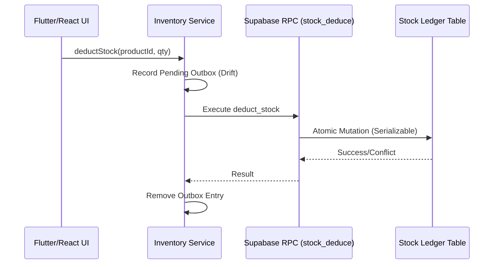

# ARCHITECTURE.md: LuckyStorePOS

## 🏗️ Repository Overview
LuckyStorePOS is a high-integrity, multi-tenant retail management system designed specifically for the operational constraints of Bangladeshi corner stores. It employs an offline-first, ledger-based architecture that prioritizes **data correctness** and **replay determinism**, ensuring consistent state transitions across disconnected mobile POS units and a centralized Supabase backend. The system design follows a strict layered separation of concerns, decoupling rendering/interaction from immutable business logic via RPC-based inventory mutations.

---

## 📁 Directory Tree
```text
.
├── apps/
│   ├── admin_web/          // Vite/React Admin Dashboard (Feature-based slices)
│   ├── mobile_app/         // Flutter POS (Offline-first, Drift SQLite)
│   └── scraper/            // Node.js Competitor Intelligence tools
├── supabase/               // PostgreSQL 17 schema, RLS, Edge Functions
├── scripts/                // Operational toolchain & Governance
│   ├── replay-certification/ // Deterministic replay engine
│   ├── governance/         // Schema parity and drift detection
│   └── ops/                // Data sync and maintenance
├── infra/                  // Migration replay infrastructure (Docker)
├── evals/                  // Distributed evaluation suite
├── lib/                    // Shared library code (Cross-platform logic)
├── artifacts/              // Governance metadata & snapshots
├── docs/                   // Comprehensive documentation
└── vercel.json             // Monorepo-level routing orchestration
```

---

## 🔍 Core Components Breakdown

| Directory/File | Responsibility | Key Dependencies/Interactions |
| :--- | :--- | :--- |
| `apps/admin_web/` | Owner-facing management portal | React 19, React Query, Supabase SDK |
| `apps/mobile_app/` | Offline-first cashier POS client | Drift ORM, Bluetooth printers, Supabase |
| `supabase/` | Multi-tenant DB & Backend logic | PostgreSQL, Deno 2 (Edge Functions) |
| `scripts/replay-certification/` | Deterministic replay & stress testing | High-concurrency Postgres isolation |
| `scripts/governance/` | Migration integrity & schema parity | Baselines, Fingerprinting |
| `lib/features/` | Shared domain-level business logic | Flutter/React cross-platform utility |

---

## 🔄 Data & Control Flow
**Core Action: Atomic Stock Deduction**



---

## 🛠️ Maintenance & Scaling Rules
1.  **Immutable Ledger Guarantee**: Never modify or delete rows in `stock_ledger` or `inventory_movements`. All corrections must be performed via new, offsetting audit-tracked transactions.
2.  **Deterministic Migration Contracts**: Any schema change must pass `scripts/replay-certification/`. Non-deterministic migrations are strictly forbidden in the production chain.
3.  **RPC-First Mutation**: Frontend components must never directly write to `stock_levels`. Every inventory mutation MUST flow through the authorized RPC layer to maintain serializable isolation.
4.  **Parity Maintenance**: All RPCs must maintain parity between the staging Supabase environment and local governance baselines. Use `npm run governance:check` before submitting PRs.
